<div align="center">

# 🛡️ Zero-Sync Debugger

### Memory-Driven Autonomous Incident Recovery Command Center

[](https://python.org)
[](https://fastapi.tiangolo.com)
[](https://react.dev)
[](https://vite.dev)
[](LICENSE)

<br/>

**AI-Powered** (Claude 3.5 Sonnet) · **Vector Memory** (Parcle) · **Auto-Deploy** (Enter Pro)

*Intercept. Remember. Reason. Patch. Deploy. — All without human intervention.*

<br/>

</div>

---

## 📌 What is Zero-Sync Debugger?

**Zero-Sync Debugger** is an autonomous, mission-critical operations command center that:

1. 🔍 **Intercepts** production runtime errors in real-time
2. 🧠 **Recalls** historical incident patterns via Parcle vector memory
3. 🤖 **Reasons** on code repairs using Claude 3.5 Sonnet AI
4. 🚀 **Deploys** surgical hotfixes through Enter Pro — zero manual debugging

It continuously learns from every incident, building an ever-growing knowledge base that makes future recoveries faster and more accurate.

### What does it detect?

| Anomaly Type | Description |
|:---|:---|
| 🧱 **Structural Exceptions** | Undefined variable lookups, null references, and range boundary errors |
| 🔗 **Context Recalls** | Semantic matches of historical fixes stored in Parcle vector memory |
| 🛡️ **Vulnerability Risks** | Automated patch evaluation to prevent regression errors |

---

## ✨ Key Features

| Feature | Description |
|:---|:---|
| ⚡ **Zero-Day Incident Recovery** | Automated identification, diagnosis, and fix generation of unknown bugs |
| 🧠 **Parcle Vector Memory** | Long-term semantic storage & query search of past incidents |
| 📊 **Memory Influence Analyzer** | Real-time confidence improvement analytics (before vs. after memory retrieval) |
| 🔄 **Reasoning Pipeline Flow** | Interactive status monitoring: Capture → Diagnose → Patch → Deploy |
| 🚀 **Enter Pro Hotfix Deployments** | Autonomous unified diff patching & rolling container builds |
| ⏪ **One-Click Safe Rollback** | Instantly revert active patches to restore service stability |
| 🖥️ **Cyber-NOC Dashboard** | High-end dark luxury telemetry interface for mission control operators |
| 🎨 **Dynamic Theme Engine** | Switch between Nebula, Matrix, Cyberpunk, and Crimson presets |
| 💻 **Built-in CLI Console** | Run NOC operations directly from the in-dashboard terminal |

---

## 🏗️ Architecture

```mermaid
graph LR
    A["🐛 Buggy App<br/>(Express :3001)"] -->|Error Event| B["📡 Ingest Webhook<br/>(Sentry / Custom)"]
    B --> C["🧠 Parcle Memory<br/>(Vector Search)"]
    B --> D["🤖 Claude 3.5 Sonnet<br/>(AI Reasoner)"]
    C -->|Historical Context| D
    D -->|Unified Diff Patch| E["✅ Patch Validator<br/>(Dry-Run)"]
    E --> F["🚀 Enter Pro<br/>(Auto-Deploy)"]
    F -->|Recovery Complete| G["📊 Cyber-NOC Dashboard<br/>(Vite + React :5173)"]
    D -->|Memory Write-Back| C

    style A fill:#ef4444,stroke:#fca5a5,color:#fff
    style B fill:#3b82f6,stroke:#93c5fd,color:#fff
    style C fill:#a855f7,stroke:#c084fc,color:#fff
    style D fill:#ec4899,stroke:#f9a8d4,color:#fff
    style E fill:#f59e0b,stroke:#fcd34d,color:#fff
    style F fill:#10b981,stroke:#6ee7b7,color:#fff
    style G fill:#6366f1,stroke:#a5b4fc,color:#fff
```



---

## 🛠️ Tech Stack

| Layer | Technology | Purpose |
|:---|:---|:---|
| **AI Engine** | Claude 3.5 Sonnet (Anthropic) | Code reasoning, patch generation |
| **Memory Layer** | Parcle Vector DB | Semantic incident storage & recall |
| **Deployment** | Enter Pro API | Production hotfix orchestration |
| **Backend** | FastAPI + Uvicorn (Python) | API server, SSE streaming, webhooks |
| **Frontend** | React 19 + Vite 8 | Cyber-NOC operations dashboard |
| **Styling** | Tailwind CSS + Framer Motion | Dark luxury UI with micro-animations |
| **Charts** | Recharts | Analytics visualization & telemetry |

---

## 🚀 Quick Start

### Prerequisites

- **Python** 3.10+
- **Node.js** 18+
- API Keys (optional — falls back to simulation mode without them):
  - `ANTHROPIC_API_KEY` — Claude 3.5 reasoning
  - `PARCLE_API_KEY` — Vector memory layer
  - `ENTER_PRO_API_KEY` — Deployment orchestrator

### 1️⃣ Clone & Configure

```bash
git clone https://github.com/VekariaDharmesh/Zero-Sync-Debugger-.git
cd Zero-Sync-Debugger-
```

```bash
# Set up environment variables
cd backend
cp .env.example .env
# Edit .env with your API keys (optional)
```

### 2️⃣ Backend Setup

<details>
<summary>🐧 Linux / macOS</summary>

```bash
cd backend
python3 -m venv venv
source venv/bin/activate
pip install --upgrade pip
pip install -r requirements.txt
```
</details>

<details>
<summary>🪟 Windows</summary>

```bash
cd backend
python -m venv venv
.\venv\Scripts\activate
pip install --upgrade pip
pip install -r requirements.txt
```
</details>

### 3️⃣ Start All Services

You need **3 terminals** running simultaneously:

| Terminal | Command | Service |
|:---|:---|:---|
| **Terminal 1** | `cd backend/demo/buggy_app && npm install && node index.js` | 🐛 Buggy Demo App → `:3001` |
| **Terminal 2** | `cd backend && uvicorn main:app --reload --port 8000` | ⚡ FastAPI Backend → `:8000` |
| **Terminal 3** | `cd frontend && npm install && npm run dev` | 🖥️ Vite Dashboard → `:5173` |

### 4️⃣ Open the Dashboard

```
🌐 http://localhost:5173
```

> 💡 **No API keys?** No problem — the platform automatically falls back to local simulation mode so the full dashboard UI remains functional.

---

## 📂 Project Structure

```
Zero-Sync-Debugger-/
│
├── backend/
│   ├── main.py                  # FastAPI server entrypoint
│   ├── config.py                # Environment configuration loader
│   ├── requirements.txt         # Python dependencies
│   │
│   ├── agent/
│   │   ├── pipeline.py          # Autonomous workflow orchestrator & SSE broadcaster
│   │   ├── reasoner.py          # Claude 3.5 Sonnet patch reasoning service
│   │   ├── patcher.py           # Unified diff parser & dry-run validator
│   │   └── deployer.py          # Enter Pro API integration & patch applier
│   │
│   ├── services/
│   │   └── parcle_service.py    # Parcle user provisioning, dialog ingest & search
│   │
│   ├── memory/
│   │   ├── parcle_client.py     # Memory routes (rollbacks, history ledger)
│   │   └── schemas.py           # Pydantic schemas (ErrorRecords, FixRecords)
│   │
│   ├── ingest/
│   │   ├── custom_logger.py     # Custom exception receiver webhook
│   │   └── sentry_webhook.py    # Sentry incident ingestion route
│   │
│   ├── streams/
│   │   └── sse.py               # Server-Sent Events subscription hub
│   │
│   └── demo/
│       └── buggy_app/           # Express server simulating production outages
│
└── frontend/
    ├── src/
    │   ├── App.tsx              # Main Cyber-NOC dashboard component
    │   ├── hooks/
    │   │   ├── useAgentState.js # SSE event state pipeline parser
    │   │   └── useEventStream.js# EventSource connection lifecycle hook
    │   └── components/          # Modular UI widgets (PatchViewer, ErrorFeed, etc.)
    │
    ├── package.json             # Vite + React dependencies
    └── vite.config.js           # Vite build configuration
```

---

## 🔧 Usage Guide

### 1. Simulating Outages

Click **"Simulate Outage"** in the dashboard top bar or trigger individual errors:

| Button | Error Type | What Happens |
|:---|:---|:---|
| `Null Ref` | TypeError | Triggers undefined property access |
| `Div/0` | RangeError | Triggers division by zero |
| `Route Match` | ReferenceError | Triggers missing route handler |

You can also use the **built-in CLI console**:
```
> outage null-ref
> outage div-zero
> outage missing-route
```

### 2. Monitoring the Pipeline

Watch the real-time reasoning flow through 8 stages:

```
Captured → Query Memory → Match Score → Diagnosed → Patch Output → Validated → Deploying → Recovered
```

The **Memory Influence Analyzer** shows confidence improvements in real-time.

### 3. Reviewing Incident History

- **Memory Timeline** — Chronological view of all Parcle vector writes
- **Engineering Journal** — Detailed postmortem reports with export (JSON/Markdown)
- **Memory Lifecycle** — Full vector document inspection with similarity metrics
- **AI Insights** — Radar charts, confidence analytics, and autonomy scoring

---

## 🔌 API Endpoints

| Method | Endpoint | Description |
|:---|:---|:---|
| `GET` | `/health` | Platform health check |
| `POST` | `/ingest/demo/trigger/{type}` | Trigger simulated error |
| `POST` | `/ingest/confirm/{pipeline_id}` | Approve pending patch deployment |
| `GET` | `/stream/events` | SSE event stream (real-time) |
| `GET` | `/memory/recent` | Fetch recent memory entries |
| `GET` | `/memory/analytics` | Memory analytics & metrics |
| `POST` | `/memory/rollback` | Rollback an active patch |

---

## 🐛 Troubleshooting

| Problem | Solution |
|:---|:---|
| **Parcle SDK connection errors** | Verify `PARCLE_API_KEY` in `.env` has correct permissions |
| **Port conflicts** | Ensure ports `3001`, `8000`, and `5173` are free |
| **SSE logs disconnected** | Check backend is running at `http://localhost:8000` |
| **Empty memory stream** | Run a simulation sequence to populate Parcle namespaces |
| **Dashboard blank/errors** | Run `npm install` in `frontend/` and restart dev server |

---

## 🔮 Roadmap

- [ ] Multi-service distributed microservice telemetry tracking
- [ ] Isolated production-preview containers for recovery validation
- [ ] Slack & Discord ChatOps integration for alert notifications
- [ ] Multi-language support (Go, Rust, Java error parsers)
- [ ] Team-based access control with role-based permissions

---

## 🤝 Contributing

Contributions are welcome! Areas of interest:

- 🧩 Improved exception parsers for additional languages
- 📐 Enhanced vector clustering and similarity algorithms
- 🎨 Custom NOC dashboard widgets and theme presets
- 📝 Documentation improvements and tutorials

```bash
# Fork → Clone → Branch → Code → PR
git checkout -b feature/your-feature-name
```

---

## 📄 License

This project is licensed under the **MIT License** — free to use, modify, and distribute.

---

<div align="center">

## 👨‍💻 Author

**Dharmesh Vekaria & Team Meridian**

📍 Gandhinagar, Gujarat · 2026

*Focused on national infrastructure safety & modern AI-driven threat detection.*

<br/>

🛡️ **Zero-Sync · Recover Faster.**

---

*Built with ❤️ for Hack Aarambh*

</div>
